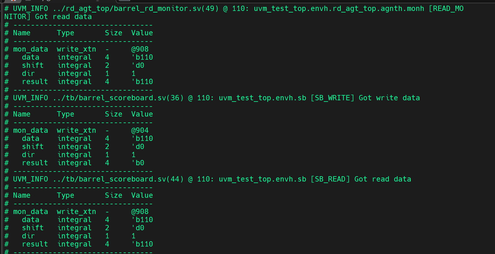
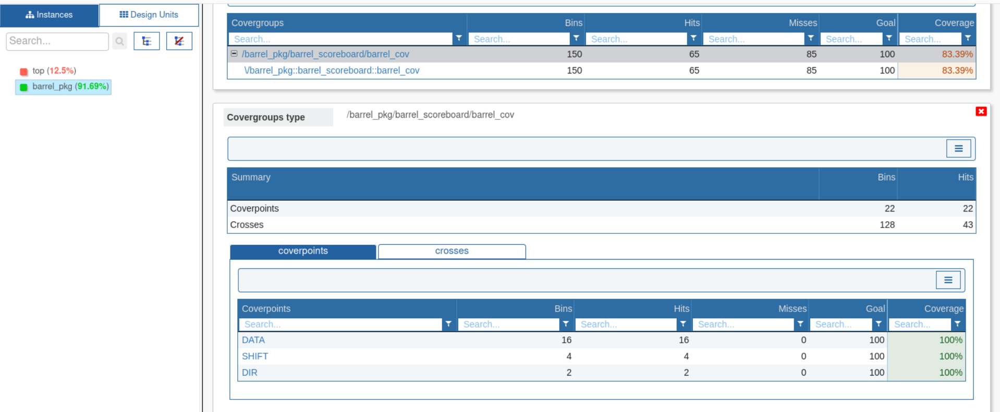
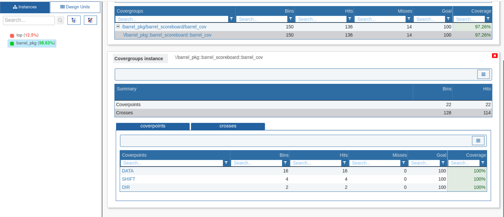

# Barrel Shifter – RTL Design and Verification

## 📌 Overview
Designed and verified a parameterized Barrel Shifter module capable of performing logical shifts.

- **EDA Tools:** QuestaSim, Xilinx Vivado  
- **Languages:** Verilog, SystemVerilog  
- **RTL Design:** Built from scratch using modular design principles  
- **UVM Testbench:** Created complete UVM-based test environment including agents, sequences, and scoreboard

---

## 📁 Folder Structure

- `rtl/` – RTL design files: `barrel_shifter.sv`, etc.
- `tb/` – Top-level testbench, UVM environment, config, scoreboard, sequencer
- `wr_agt_top/` – Write agent: driver, monitor, sequence, agent, config
- `rd_agt_top/` – Read agent: monitor, sequence, agent, config
- `test/` – UVM test classes and virtual sequences
- `sim/` – Makefile and simulation run scripts
- `docs/` – Waveform screenshots and synthesis reports

---

## ✅ Features

- RTL Barrel Shifter with shift-left and shift-right functionality
- Reusable UVM components for scalability
- Assertion-based verification
- Functional coverage
- QuestaSim and Vivado simulation support

---

## 🖼️ Waveform & Coverage Snapshots

### ✅ Simulation Waveform  
**QuestaSim Output:**  

### ✅ Functional Coverage  
**Coverage 1:**  

**Coverage 2:**  

---

